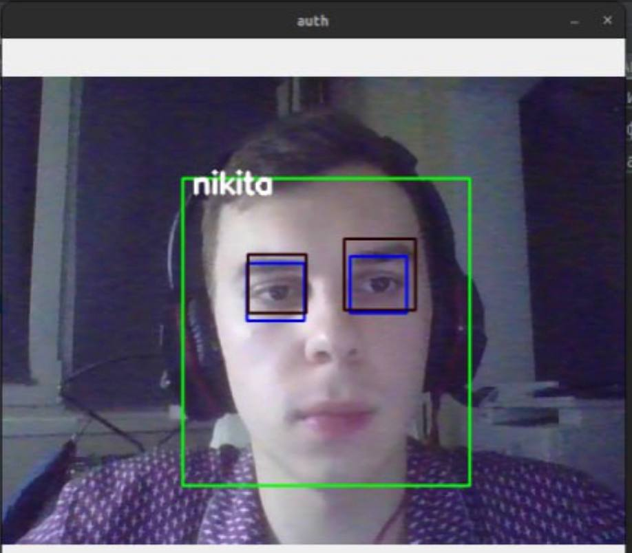

<h1> Биометрический считыватель</h1>>
Программа имеет 2 режима:  
1) аутентификация - по поступающему видео перебирает датасет 
датасет представляет собой зашифрованную БД  
2) регистрация - записывается видео и из него берутся фото для датасета  
Оба режима поддерживают ip-камеры с помощью протокола rtsp  
Распознование сделано на opencv2 + face-recognition 
Также добавлена возможность проверки на liveness. Проверка осуществляется через фильтры Хаара, 
1 умеет определять только открытые глаза, другой открытые и закрытые  
Проект по Аппаратным средствам, так что тут же и разводка ПП / сборочный чертеж 
Пара фото:  

